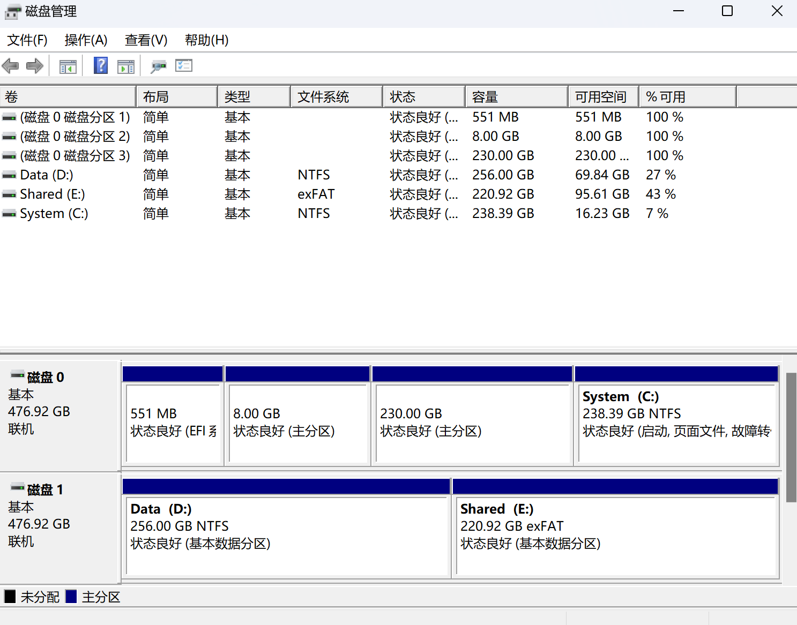

## 先Windows还是Linux？

Windows和Linux都能识别的文件系统是exfat（ext和fat文件系统的结合）,因此我们只需在磁盘上划分一个新的分区，格式化为exfat即可。

那么在顺序上呢，显然有两种选择：
1. 在Windows下新建卷，格式化为exfat，再到Linux下挂载该分区。
2. 在Linux下新建格式为exfat的分区，然后直接切换到Windows查看该分区...?

是的，第二种顺序总感觉缺少些什么，事实上也确实如此，先在Linux下建立分区后，再切换到Windows，你会发现这个新的分区就像Linux其他的ext分区一样无法被识别出来。（原因未知）

个人经验所得，第一种是完全可行的，如果你有Linux分区挂载的经验，那基本上不会遇见什么问题，就可以退出这篇文章了，如果你不太明白，可以继续往下看详细步骤。


## 详细步骤
### 1. 在Windows下新建卷，格式化为exfat

打开`磁盘管理`，你可以看到机子上的所有硬盘，以及分区情况，如果你没有空闲分区，就选择你想要改为共享分区的那块，右击选择删除卷；再右击选择新建卷，在其中选择你要划分的大小以及格式（exfat），如果划分的大小小于空闲分区，那么就会把剩余的作为新的空闲分区。

### 2. 在Linux中挂载分区

切换到Linux，首先我们需要查看新的分区具体是Linux中的哪个设备文件

```shell
df -T
```

`df -T`命令可以展示本机当中的所有硬盘以及其中的分区信息，并且还会附上如磁盘型号，单元大小，label类型（MBR还是gpt）



